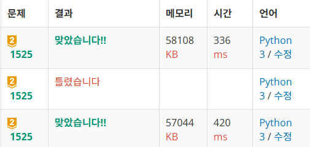

## 1. 문제 정보 (Problem)

  - **문제 이름**: 퍼즐
  - **출처 및 번호**: [백준 1525번](https://www.acmicpc.net/problem/1525)
  - **난이도**: 골드 2
  - **문제 요약**: 숫자 퍼즐을 순서대로 정리하는 최소 이동 횟수 구하기 (이동 불가능한 경우 -1 출력)

---
## 2. 핵심 아이디어 (Core Logic)
최단경로 => BFS
- 3*3 퍼즐 상태는 2차원 배열이 아닌 문자열로 저장
- 왜? 메모리 효율 / 단순한 좌표 관리 / set에 방문 기록하기 좋음.
- 이동 가능한 인접칸의 인덱스 -> 배열에 미리 저장해두기

- 중복 방문, 무한 루프 방지 => set에 방문 기록

---
## 3. 어려웠던 점 (Difficulties)


---
## 4. 새롭게 배운 점 (What I Learned)
### Parity check (패리티 검사)
- 퍼즐이 실제로 풀 수 있는 상태인지 미리 판별하는 수학적 규칙
- 시작 상태의 타일 순서가 정답 상태와 같은 짝/홀 구조인지 확인하는 과정 -> 패리티가 다르면 절대 풀 수 없다! -> 불가능한 입력 미리 거르기
- 패리티(짝수/홀수)
    - 먼저 퍼즐을 1차원으로 펼친다
    - 타일의 순서가 정답 상태에 비해 얼마나 꼬여 있는가 => inversion count(역전 개수)로 표현
    - 빈칸 제외하고, 앞에 있는 수가 뒤의 수보다 큰 경우 => 역전 1개 카운트
    - 시작 상태와 정답 상태의 역전 개수 패티리(짝/홀) 같아야 풀 수 있음
    - 여기선 짝수면 풀 수 있음. 홀수면 절대 못 품.


---
## 5. 코드 개선 (Refactoring)
- 처음 코드
```python
import sys
from collections import deque

def bfs(initial):
    '''
    9자리 퍼즐 문자열을 인자로 받아, 
    빈칸 0을 이동가능한 인덱스 위치로 이동한다.
    BFS를 진행하면서 정답상태와 동일해지면 그때의 이동횟수를 반환한다.
    BFS 다 돌려도 정답상태에 도달하지 못했다면, -1을 반환한다.
    '''
    visited = {initial}  # 무한루프 방지, 초기 상태 기록
    
    
    dq = deque([(initial, 0)])  # (문자열, 이동횟수)
    
    while dq:
        cur_str, cur_move = dq.popleft()
        
        if cur_str == answer_str:  # 정답상태 도달한 경우
            return cur_move
        
        blank_idx = cur_str.index('0')  # 빈칸 인덱스
        
        for idx_to_change in move_idx[blank_idx]:
            head = min(blank_idx, idx_to_change)
            rear = max(blank_idx, idx_to_change)
            next_str = cur_str[:head] + cur_str[rear] + cur_str[(head+1):rear] + cur_str[head] + cur_str[(rear+1):]
            if next_str in visited:
                continue
            else:
                visited.add(next_str)
                dq.append((next_str, cur_move + 1))
                
            
    return -1 


initial_state = sys.stdin.readlines()  # 3줄 한번에 입력받기

initial_str = ''  # 문자열 1줄로 평탄화
for row in initial_state: 
    initial_str += ''.join(row.split())

# 정답 상태 정의
answer_str = '123456780'

# 이동 가능한 인덱스 미리 구해두기
move_idx = [
    [1, 3],
    [0, 2, 4],
    [1, 5],
    [0, 4, 6],
    [1, 3, 5, 7],
    [2, 4, 8],
    [3, 7],
    [4, 6, 8],
    [5, 7]
    ]


ans = bfs(initial_str)
print(ans)
```

### [ 개선할 점 ]
1. 불변 문자열 슬라이싱 대신 가변 리스트 스왑으로 비용 줄이기
    ```python
            for idx_to_change in move_idx[blank_idx]:
            temp_list = list(cur_str)
            temp_list[blank_idx], temp_list[idx_to_change] = temp_list[idx_to_change], temp_list[blank_idx]
            next_str = ''.join(temp_list)
    ```
  - 리팩토링 결과: 실행시간 단축 (420ms -> 336ms)
  


2. 불가능 케이스? 역순 개수 짝/홀? 패리티 검사? -> 조기 종료
    ```python
    # 패리티 검사 : 역전 개수(빈칸 제외)가 홀수면 풀 수 없음!
    inversion_cnt = 0
    for i1 in range(9):
        for i2 in range(i1+1, 9):
            c1 = int(initial_str[i1])
            c2 = int(initial_str[i2])
            if c1 == 0 or c2 == 0:
                continue
            if c1 > c2:
                inversion_cnt += 1
    if inversion_cnt % 2 != 0:
        print(-1)
    else:
        ans = bfs(initial_str)
        print(ans)
    ```
    

3. 변경할 일 없는 move_idx는 튜플로 저장 -> 불변성 보장

4. 상수는 대문자 변수명으로 정하고, 상단에 배치!

- 최종 코드
[solution.py](solution.py)